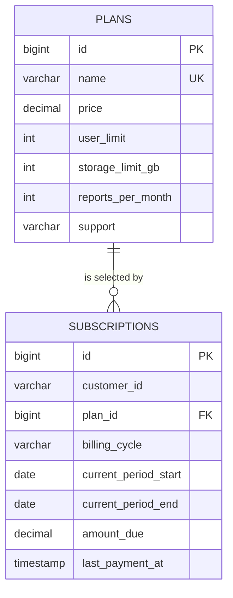

# Edabip Prathibha API

Day 1 establishes the database foundation for a subscription plans API: a MySQL schema for plans and subscriptions, sample plan data, and a Spring Boot REST API backed by JDBC.

## What’s included

- Plan listing and lookup
- Subscription creation and lookup
- A database health endpoint
- Request validation and a consistent JSON response envelope
- Swagger UI, an OpenAPI document, and a Postman collection

The application uses Spring JDBC (`JdbcTemplate`) and MySQL. It does not use JPA or Hibernate.

## Requirements

- Java 17 or newer
- Maven 3.6.3 or newer
- MySQL 8.0.16 or newer (for enforced `CHECK` constraints)

## Database setup

Create the database:

```sql
CREATE DATABASE edabip_prathibha CHARACTER SET utf8mb4 COLLATE utf8mb4_0900_ai_ci;
```

From the repository root, apply the schema first and then the sample data:

```sh
mysql -u root -p edabip_prathibha < schema.sql
mysql -u root -p edabip_prathibha < seed.sql
```

`schema.sql` creates:

- `plans`: plan name, price, user and storage limits, monthly report limit, and support level.
- `subscriptions`: customer, selected plan, billing cycle, billing period, amount due, and last payment timestamp.

The schema enforces nonnegative prices and amounts, positive plan limits, valid billing cycles (`monthly` or `annual`), and an end date after the period start. A foreign key links each subscription to a plan. The seed script inserts Basic, Standard, and Enterprise examples; replace these sample prices and limits with approved product values before production use.

## Configuration

The defaults are database `edabip_prathibha` on `localhost:3306`, username `root`, password `root`, and API port `8080`. Override them with environment variables:

| Variable | Default | Purpose |
| --- | --- | --- |
| `DB_URL` | `jdbc:mysql://localhost:3306/edabip_prathibha?serverTimezone=UTC` | JDBC connection URL |
| `DB_USERNAME` | `root` | MySQL username |
| `DB_PASSWORD` | `root` | MySQL password |
| `PORT` | `8080` | HTTP port |

PowerShell example:

```powershell
$env:DB_PASSWORD = 'your-password'
```

## Run the API

```sh
mvn spring-boot:run
```

To package and run the application:

```sh
mvn clean package
java -jar target/prathibha-api-0.1.0.jar
```

## Endpoints

| Method | Endpoint | Description |
| --- | --- | --- |
| `GET` | `/health` | Checks API and database connectivity |
| `GET` | `/api/v1/plans` | Lists plans ordered by price |
| `GET` | `/api/v1/plans/{id}` | Gets a plan by ID |
| `POST` | `/api/v1/subscriptions` | Creates a subscription |
| `GET` | `/api/v1/subscriptions/{id}` | Gets a subscription by ID |

Create a subscription with a plan ID returned by the plans endpoint:

```sh
curl -X POST http://localhost:8080/api/v1/subscriptions \
  -H 'Content-Type: application/json' \
  -d '{
    "customerId": "customer-001",
    "planId": 1,
    "billingCycle": "MONTHLY",
    "currentPeriodStart": "2026-10-01",
    "currentPeriodEnd": "2026-11-01"
  }'
```

`billingCycle` accepts `MONTHLY` or `ANNUAL` in the API request. The database stores these as lowercase values. `amountDue` is initialized to the selected plan’s price for either cycle; annual pricing adjustments are not implemented.

All responses use a shared envelope. A successful response has this shape:

```json
{ "success": true, "data": { "id": 1 }, "error": null }
```

Errors return `success: false` and include an error code, message, and optional details.

## API documentation and Postman

- Swagger UI: [http://localhost:8080/swagger-ui.html](http://localhost:8080/swagger-ui.html)
- OpenAPI JSON: [http://localhost:8080/v3/api-docs](http://localhost:8080/v3/api-docs)
- Postman collection: [`postman/edabip-prathibha-api.postman_collection.json`](postman/edabip-prathibha-api.postman_collection.json). Set `baseUrl` and update `planId` and `subscriptionId` as needed.

## Data model


