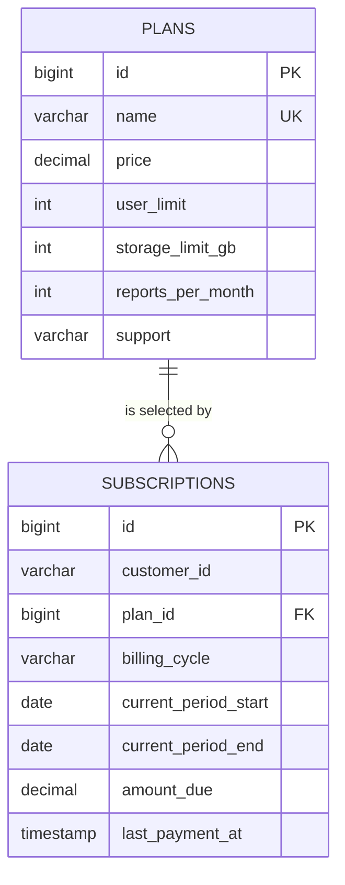

# Edabip Prathibha Billing API

A Spring Boot REST API for subscription plans and customer subscriptions. It uses Spring JDBC (`JdbcTemplate`) with MySQL; it does not use JPA or Hibernate.

## Project layout

```text
src/main/java/com/edabip/billing/
|-- EdabipApplication.java
|-- controller/   HTTP endpoints
|-- service/      application logic
|-- repository/   JDBC queries and row mapping
|-- model/        request and response models
`-- exceptionHandler/ shared response format and exception handling

src/main/resources/
|-- application.properties
|-- schema.sql
`-- data.sql
```

## Requirements

- Java 17 or newer
- Maven 3.6.3 or newer
- MySQL 8.0.16 or newer

## Database setup

Create the database in MySQL:

```sql
CREATE DATABASE edabip_prathibha CHARACTER SET utf8mb4 COLLATE utf8mb4_0900_ai_ci;
```

From the repository root, apply the schema and then insert the sample plans:

```sh
mysql -u root -p edabip_prathibha < src/main/resources/schema.sql
mysql -u root -p edabip_prathibha < src/main/resources/data.sql
```

The schema creates `plans` and `subscriptions`. It defines a foreign key from subscriptions to plans and checks plan limits, nonnegative amounts, billing cycles, and subscription period dates. The sample plans are Basic, Standard, and Enterprise. Replace their example prices and limits with product-approved values before production use.

## Configuration

`src/main/resources/application.properties` reads these environment variables:

| Variable | Default | Description |
| --- | --- | --- |
| `DB_URL` | `jdbc:mysql://localhost:3306/edabip_prathibha?serverTimezone=UTC` | MySQL JDBC URL |
| `DB_USERNAME` | `root` | MySQL username |
| `DB_PASSWORD` | `123456` | MySQL password |
| `PORT` | `8080` | HTTP port |

PowerShell example:

```powershell
$env:DB_PASSWORD = 'your-password'
```

SQL initialization is disabled at application startup. Apply `schema.sql` and `data.sql` manually as shown above; this avoids rerunning `CREATE TABLE` every time the API starts.

## Run

```sh
mvn spring-boot:run
```

Or build and run the executable jar:

```sh
mvn clean package
java -jar target/prathibha-api-0.1.0.jar
```

## API endpoints

| Method | Endpoint | Description |
| --- | --- | --- |
| `POST` | `/api/plans` | Creates a plan |
| `GET` | `/api/plans` | Lists plans ordered by price |
| `GET` | `/api/plans/{id}` | Gets a plan by ID |
| `PUT` | `/api/plans/{id}/activate` | Activates a plan |
| `PUT` | `/api/plans/{id}/deactivate` | Deactivates a plan |
| `GET` | `/api/subscription?customerId={customerId}` | Gets the customer's current subscription |
| `POST` | `/api/subscription` | Creates a subscription |
| `GET` | `/api/subscription/{id}` | Gets a subscription by ID |
| `PUT` | `/api/subscription/{id}/plan` | Changes a subscription's plan |

The current-subscription endpoint requires a `customerId` because the API does not include authentication or a customer session. It returns a subscription whose billing period includes today's date; if multiple periods match, it returns the one with the latest start date.

Create a plan:

```sh
curl -X POST http://localhost:8080/api/plans \\
  -H 'Content-Type: application/json' \\
  -d '{
    "name": "Business",
    "price": 49.99,
    "userLimit": 25,
    "storageLimitGb": 100,
    "reportsPerMonth": 500,
    "support": "Priority email"
  }'
```

List plans:

```sh
curl http://localhost:8080/api/plans
```

Get a customer's current subscription:

```sh
curl "http://localhost:8080/api/subscription?customerId=customer-001"
```

Create a subscription:

```sh
curl -X POST http://localhost:8080/api/subscription \
  -H 'Content-Type: application/json' \
  -d '{
    "customerId": "customer-001",
    "planId": 1,
    "billingCycle": "MONTHLY",
    "currentPeriodStart": "2026-10-01",
    "currentPeriodEnd": "2026-11-01"
  }'
```

`billingCycle` accepts `MONTHLY` or `ANNUAL`. `amountDue` is initialized to the selected plan's price for either cycle; annual pricing adjustments are not implemented.

Change a subscription's plan (the subscription period stays the same, and `amountDue` is set to the new plan's price):

```sh
curl -X PUT http://localhost:8080/api/subscription/1/plan \
  -H 'Content-Type: application/json' \
  -d '{"planId": 2}'
```

Activate or deactivate a plan:

```sh
curl -X PUT http://localhost:8080/api/plans/2/activate
curl -X PUT http://localhost:8080/api/plans/2/deactivate
```

Inactive plans remain visible in the plan list but cannot be used for new subscriptions or plan changes. Existing subscriptions to a deactivated plan continue to work.

For databases created before plan activation was added, apply `src/main/resources/upgrade-day2.sql` once before starting the updated API. For a new database, use the updated `schema.sql` instead.

## Responses and validation

Responses use a shared JSON envelope. For example:

```json
{
  "success": true,
  "data": [{ "id": 1, "name": "Basic" }],
  "error": null
}
```

Errors use `success: false` and include an error code, message, and optional details. Request fields and positive path IDs are validated; invalid requests return a `400`, and missing records return a `404`.

## Swagger and OpenAPI

- Swagger UI: [http://localhost:8080/swagger-ui.html](http://localhost:8080/swagger-ui.html)
- OpenAPI JSON: [http://localhost:8080/v3/api-docs](http://localhost:8080/v3/api-docs)

## ER diagram


