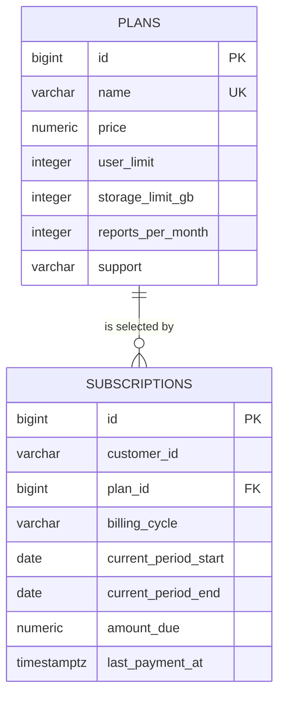

# Edabip Prathibha API

REST API for subscription plans and subscriptions, built with Java, Spring Boot, PostgreSQL, and JDBC. Persistence uses `JdbcTemplate`; the project does not use JPA or Hibernate.

## Requirements

- Java 17 or newer
- Maven 3.6.3 or newer
- PostgreSQL

## Setup

1. Create a PostgreSQL database:

   ```sql
   CREATE DATABASE edabip_prathibha;
   ```

2. Apply the schema and sample plan data from the repository root:

   ```sh
   psql -U postgres -d edabip_prathibha -f schema.sql
   psql -U postgres -d edabip_prathibha -f seed.sql
   ```

   `seed.sql` contains example prices and limits. Replace them with product-approved values before using the API in production.

3. Configure the database. Defaults are `localhost:5432`, database `edabip_prathibha`, user `postgres`, password `postgres`. Override them with environment variables:

   ```sh
   DB_URL=jdbc:postgresql://localhost:5432/edabip_prathibha
   DB_USERNAME=postgres
   DB_PASSWORD=your-password
   PORT=8080
   ```

   PowerShell example:

   ```powershell
   $env:DB_PASSWORD = 'your-password'
   ```

4. Start the API:

   ```sh
   mvn spring-boot:run
   ```

   Or package and run the jar:

   ```sh
   mvn clean package
   java -jar target/prathibha-api-0.1.0.jar
   ```

## Architecture

```text
Controller  ->  Service  ->  Repository (JdbcTemplate)  ->  PostgreSQL
```

- `controller` endpoints parse requests and produce response envelopes.
- `service` contains application rules and not-found checks.
- `repository` contains SQL and row mapping.
- `common` contains the shared response format and global exception handler.

## API

All API responses use the same envelope. Successful responses look like:

```json
{ "success": true, "data": { "id": 1 }, "error": null }
```

Errors use `success: false` and include a stable error code, message, and optional details.

| Method | Endpoint | Description |
| --- | --- | --- |
| `GET` | `/health` | Checks API and database availability |
| `GET` | `/api/v1/plans` | Lists plans ordered by price |
| `GET` | `/api/v1/plans/{id}` | Gets a plan |
| `POST` | `/api/v1/subscriptions` | Creates a subscription |
| `GET` | `/api/v1/subscriptions/{id}` | Gets a subscription |

Create subscription example:

```sh
curl -X POST http://localhost:8080/api/v1/subscriptions \
  -H 'Content-Type: application/json' \
  -d '{
    "customerId": "customer-001",
    "planId": 1,
    "billingCycle": "MONTHLY",
    "currentPeriodStart": "2026-10-01",
    "currentPeriodEnd": "2026-11-01"
  }'
```

`amountDue` is initialized from the selected plan's `price` for both billing cycles; annual discounts or multipliers are not applied yet.

## Swagger and Postman

- Swagger UI: [http://localhost:8080/swagger-ui.html](http://localhost:8080/swagger-ui.html)
- OpenAPI document: [http://localhost:8080/v3/api-docs](http://localhost:8080/v3/api-docs)
- Import [`postman/edabip-prathibha-api.postman_collection.json`](postman/edabip-prathibha-api.postman_collection.json) into Postman. Set `baseUrl`, and set `planId`/`subscriptionId` as needed.

## ER diagram


